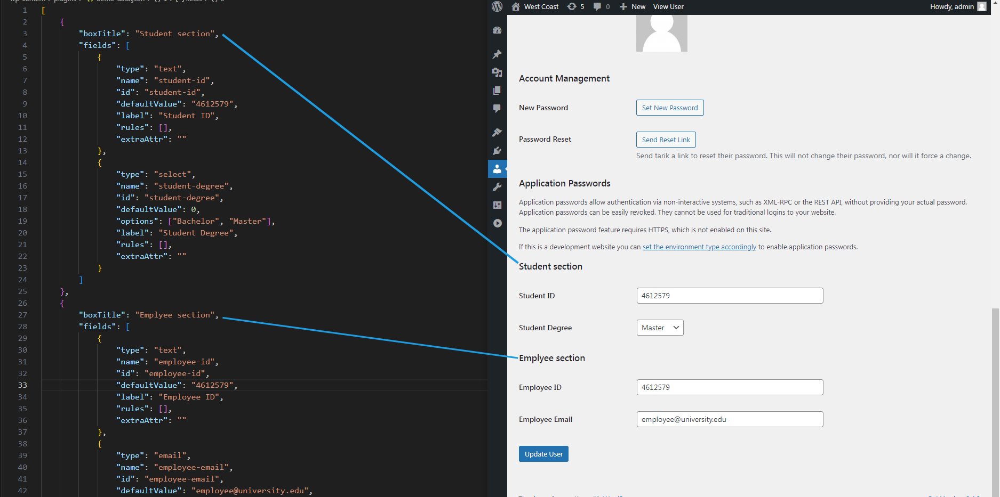

# User Meta Data for WordPress: Extend the User Profile Screen
** This plugin simplifies the process of adding additional fields to the WordPress user profile screen by utilizing a JSON file. **

Simplify the management of user profile fields in WordPress with this plugin, employing Object-Oriented Programming (OOP) for organized field additions. Say goodbye to complex HTML and PHP combinations; instead, effortlessly configure desired fields and associated rules using a straightforward JSON file. Additionally, enjoy hassle-free validation powered by Valitron, a minimalist, standalone validation library with no external dependencies. Upgrade your user profile screen customization experience with ease and efficiency.

## How to use the plugin
#### Visual Guide: A Picture is Worth a Thousand Words

